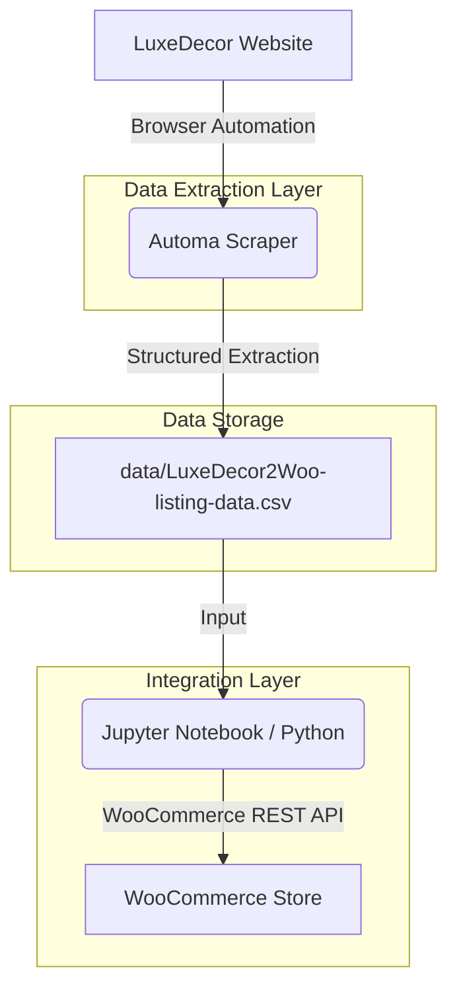

# WooCommerce Product Lister

This document outlines the technical architecture, data flow, and legal compliance for the LuxeDecor to WooCommerce automation system.

## 1. Project Overview
This project provides an automated pipeline to extract furniture product data from a supplier website (LuxeDecor) and synchronize it with a WooCommerce store. It handles complex product relationships, including variable products and their respective variations.

## 2. System Architecture

### Components:
1.  **Extraction Layer (Automa):** Uses a browser-based workflow (`automa/LuxeDecor2SC_Lister.automa.json`) to navigate product pages, handle dynamic content, and scrape metadata.
2.  **Storage Layer (CSV):** A standardized intermediate format (`data/LuxeDecor2Woo-listing-data.csv`) that maps supplier data to WooCommerce-compatible fields.
3.  **Integration Layer (Python/REST API):** A Jupyter Notebook (`google-colab/LuxeDecor2SC_Lister.ipynb`) that processes the CSV data, maps categories, and executes API calls to create/update products on WooCommerce.

## 3. Technical Specifications
- **Scraper:** Automa Workflow (v1.30.01+).
- **Language:** Python 3.x.
- **API:** WooCommerce REST API v3.
- **Data Format:** UTF-8 CSV.
- **Authentication:** OAuth 1.0a (Consumer Key/Secret).

## 4. Legal & Ethical Compliance

### **Important Disclaimer**
**This project is for EDUCATIONAL PURPOSES ONLY.** The code and workflows provided are intended to demonstrate automation techniques and API integrations.

### **Compliance Requirements:**
- **Supplier Permission:** You MUST obtain explicit written permission from the supplier (e.g., LuxeDecor) before running any scraping workflows against their infrastructure. 
- **Terms of Service:** Users of this tool are responsible for ensuring compliance with the supplier's `robots.txt` file and Website Terms of Use.
- **Rate Limiting:** If permission is granted, users must implement responsible rate limiting to avoid putting undue stress on the supplier's servers.
- **Privacy:** Do not use this system to scrape personal data. This tool is designed for public product metadata only.
- **No Warranty:** The authors and contributors are not responsible for any misuse, account suspensions, or legal actions resulting from the use of this software. Use at your own risk.

## 5. Setup & Usage
1.  **Import Workflow:** Load the `.automa.json` file into the Automa browser extension.
2.  **Run Scraper:** Execute the workflow to generate the `LuxeDecor2Woo-listing-data.csv`.
3.  **Configure API:** Update the `consumer_key` and `consumer_secret` in the Jupyter Notebook.
4.  **Execute Listing:** Run the notebook cells to upload products to your WooCommerce store.

